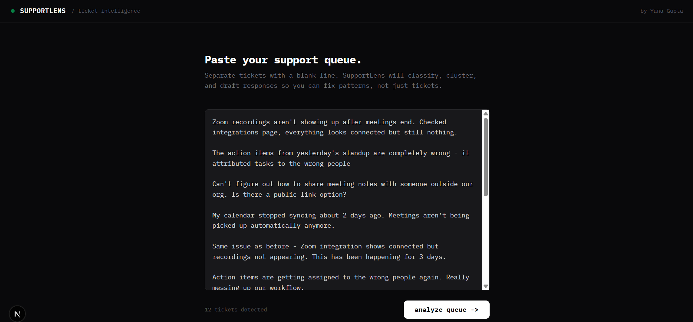
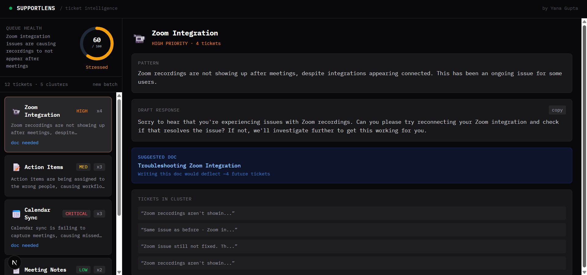

# SupportLens

**AI-powered ticket triage dashboard for support engineers.**

Paste a batch of raw support tickets → SupportLens clusters them by issue type,
surfaces repeat patterns, drafts responses, and flags which problems need a help
doc written.

The goal: fix patterns, not just tickets.




---

## Why I built this

Support queues are noisy. The real problem isn't answering tickets — it's *seeing*
what's actually happening across all of them at once. Which issues are the same
bug reported 6 different ways? What's spiking this week? What single help doc
would eliminate 10% of the queue?

Reading tickets one-by-one doesn't answer that. SupportLens does.

This is the tool I'd want on day one of a support engineering role.

---

## What it does

**1. Pattern Detection**
Groups similar tickets into clusters automatically. Surfaces repeat issues with
volume counts — so "Zoom integration broken" showing up 4 times in one day gets
flagged immediately, not discovered at end of week.

**2. Priority Triage**
Each cluster is scored: critical / high / medium / low. The queue health score
(0–100) gives an at-a-glance read on whether things are on fire.

**3. Draft Responses**
Per cluster, generates a warm, specific draft reply ready to copy. Cuts response
time without sacrificing quality.

**4. Doc Deflection**
Flags which clusters would be eliminated by writing a help article, and suggests
the title. Every resolved ticket should leave a trail — this makes that automatic.

---

## Stack

- **Next.js 15** — frontend + API routes (no separate backend)
- **TypeScript** — end to end  
- **Tailwind CSS** — styling
- **Groq API** (llama-3.3-70b) — classification, clustering, response drafting

Groq was a deliberate choice: it's free, and llama-3.3-70b at Groq's inference
speeds returns structured JSON in under a second — fast enough to feel instant
in the UI.

---

## Running locally

```bash
git clone ..
cd supportlens
npm install
cp .env.example .env.local
```

Get a free Groq API key at **console.groq.com** (no credit card required), and
add it to `.env.local`:

```
GROQ_API_KEY=your_key_here
```

```bash
npm run dev
```

Open [http://localhost:3000](http://localhost:3000) and paste in your ticket batch.

---

## What's next

- [ ] CSV upload for bulk import from Intercom / Zendesk exports
- [ ] Webhook integration — pipe tickets in directly from your support tool
- [ ] Persistent pattern history across batches — track what's trending week over week
- [ ] Slack alert when a critical cluster is detected
- [ ] One-click full help doc draft generated from a cluster

